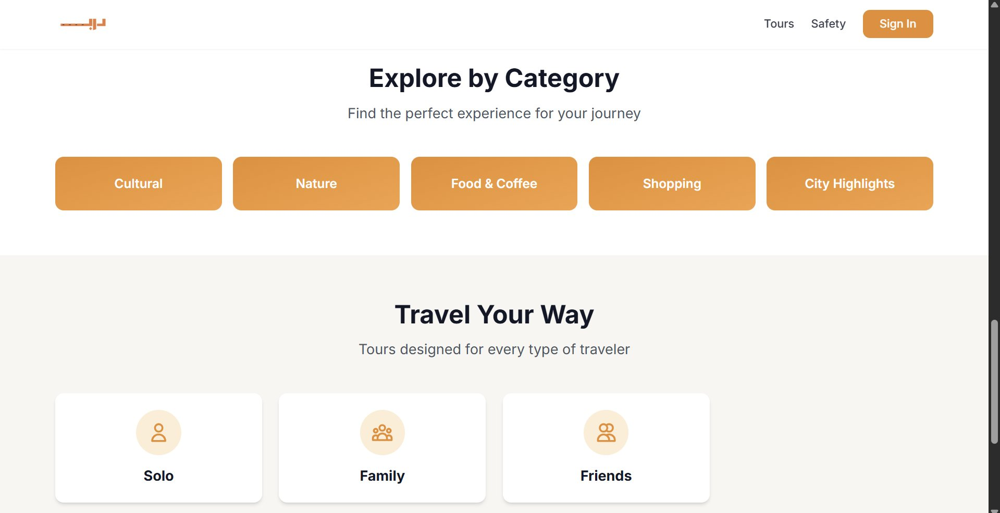
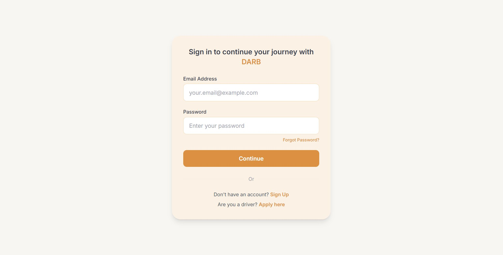
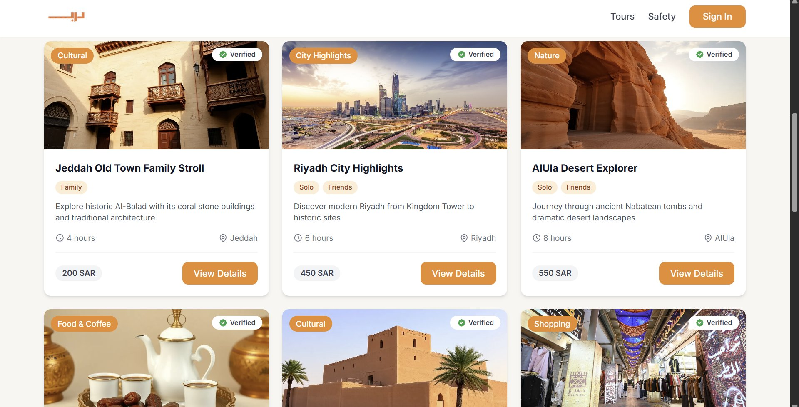
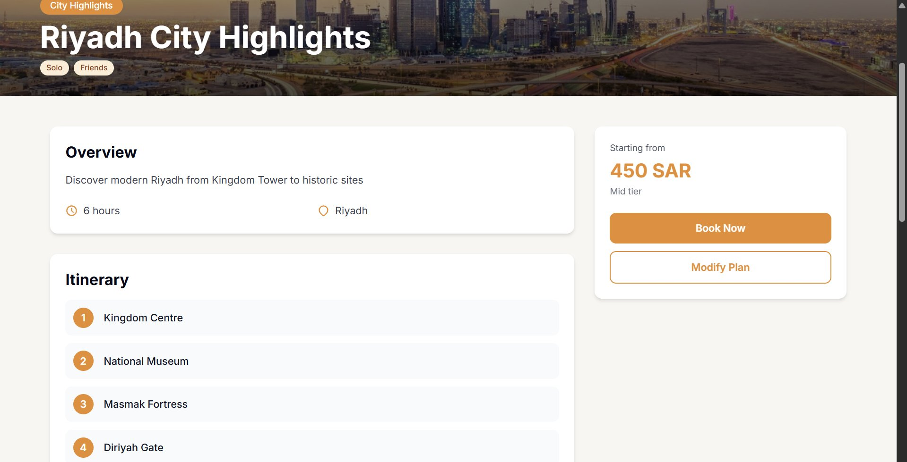
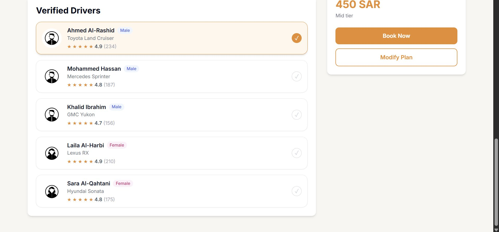

# 🚖 Darb — Tourism Platform with Zero-Trust Safety

> *"Your Journey, Your Way."* — A smart, secure tourism and ride-hailing platform connecting tourists with verified local drivers across Saudi Arabia.

---

## 📌 Table of Contents

- [Project Overview](#-project-overview)
- [Screenshots](#-screenshots)
- [Core Features](#-core-features)
- [Zero-Trust Security Framework](#-zero-trust-security-framework)
- [Driver Verification](#-driver-verification)
- [Tour Categories](#-tour-categories)
- [Why Darb?](#-why-darb)
- [Technologies Used](#-technologies-used)
- [System Architecture](#-system-architecture)
- [Extra Features](#-extra-features)

---

## 📖 Project Overview

**Darb** (درب) is a smart, secure tourism and ride-hailing platform designed to connect tourists with **verified local drivers** while enforcing a full **Zero-Trust Security Framework**.

The platform delivers a safe, transparent, and convenient travel experience by offering:

- ✅ **Ready-made, expert-curated tour plans** across Saudi Arabia
- ✅ **Verified driver matching** with full background screening
- ✅ **Zero-Trust security** — continuous authentication at every layer
- ✅ **Flexible customization** — modify any plan before confirming
- ✅ **Arabic & English** language support

Darb reimagines tourism across Saudi Arabia by combining **verification, trust, and transparency** to ensure a highly secure travel experience.

---

## 📸 Screenshots

### 🗂️ Explore by Category
Browse tours by type — Cultural, Nature, Food & Coffee, Shopping, and City Highlights. Choose your traveler style: Solo, Family, or Friends.



---

### 🔐 Sign In
Secure authentication screen with email/password login, sign up flow, and a dedicated driver application portal.



---

### 🗺️ Tour Listings
Verified, staff-curated tour cards showing category, duration, location, price (SAR), and traveler type tags.



---

### 📋 Tour Detail & Itinerary
Each tour shows a full itinerary with numbered stops, duration, location, price tier, and options to **Book Now** or **Modify Plan**.



---

### 🚘 Verified Driver Selection
Tourists choose from a pool of verified drivers filtered by rating, vehicle type, and gender preference. Each driver is fully background-checked.



---

## 🌟 Core Features

### 1️⃣ Ready-Made Tour Plans

Professional itineraries built and verified by Darb staff — **not AI-generated**. Each plan is carefully curated for quality and accuracy.

**Traveler Categories:**

| Category | Description |
|----------|-------------|
| 👤 Solo | Independent explorers — flexible, self-paced tours |
| 👥 Friends | Group-friendly experiences and shared adventures |
| 👨‍👩‍👧‍👦 Family | Family-safe, accessible, and fun for all ages |

**Plan Types:**

| Type | Experience |
|------|-----------|
| 🕌 Cultural | Heritage sites, historical landmarks, traditional architecture |
| 🛍️ Shopping | Malls, souks, and local markets |
| 🌊 Nature | Beaches, parks, deserts, and natural landscapes |
| 🍴 Food & Coffee | Top cafés, restaurants, and local cuisine |
| 🏙️ City Highlights | "Top 5 must-see attractions in one day" |

Each plan includes:  
📍 Route map | ⏱️ Timing | 💵 Upfront cost | 🚘 Pre-assigned verified driver

> **Note:** Users can **modify** any plan before confirming — such as changing a stop or selecting a preferred driver.

---

### 2️⃣ Sample Tours Available on Darb

| Tour | Type | Category | Duration | Price |
|------|------|----------|----------|-------|
| Jeddah Old Town Family Stroll | Cultural | Family | 4 hrs | 200 SAR |
| Riyadh City Highlights | City Highlights | Solo, Friends | 6 hrs | 450 SAR |
| AlUla Desert Explorer | Nature | Solo, Friends | 8 hrs | 550 SAR |

**Example — Riyadh City Highlights Itinerary:**

| Stop | Location |
|------|----------|
| 1️⃣ | Kingdom Centre |
| 2️⃣ | National Museum |
| 3️⃣ | Masmak Fortress |
| 4️⃣ | Diriyah Gate |

**Example — Verified Drivers Pool:**

| Driver | Gender | Vehicle | Rating |
|--------|--------|---------|--------|
| Ahmed Al-Rashid | Male | Toyota Land Cruiser | ⭐ 4.9 (234 reviews) |
| Mohammed Hassan | Male | Mercedes Sprinter | ⭐ 4.8 (187 reviews) |
| Khalid Ibrahim | Male | GMC Yukon | ⭐ 4.7 (156 reviews) |
| Laila Al-Harbi | Female | Lexus RX | ⭐ 4.9 (210 reviews) |
| Sara Al-Qahtani | Female | Hyundai Sonata | ⭐ 4.8 (175 reviews) |

---

### 3️⃣ Driver Matching & Verification

Tourists choose from a list of **verified drivers**, filtered by:

- ⭐ Ratings & reviews
- 🌐 Languages spoken
- 🚘 Vehicle type
- 👩/👨 Gender preference

---

## 🛡️ Zero-Trust Security Framework

**"Never trust, always verify."**

Every user, driver, and device is continuously authenticated throughout the entire journey.

| Layer | Security Control |
|-------|-----------------|
| 🔒 **Identity** | 2-factor login, verified accounts |
| 🧠 **Behavior** | Route anomaly detection & risk scoring |
| 📡 **Monitoring** | Live trip tracking, automated SOS |
| 🚨 **Response** | 24/7 emergency support & police link |
| 🛡️ **Compliance** | Insurance & regulatory audits |

---

## ✅ Driver Verification Process

Before any driver is approved on Darb, they go through:

```
✔ ID & license validation
✔ Car registration + insurance check
✔ Government background screening
✔ Continuous re-authentication during active trips
```

---

## 🎯 Why Darb?

| Tourist Challenge | Darb Solution |
|-------------------|---------------|
| Unsafe / unverified drivers | Full Zero-Trust, multi-layer verification |
| Lack of personalization | Plans tailored by Solo / Friends / Family categories |
| Confusing pricing | Clear breakdowns & upfront cost |
| No safety net | SOS, live monitoring, insurance, verified drivers |
| Language barriers | Full Arabic + English support |

---

## 🛠️ Technologies Used

| Layer | Technology |
|-------|-----------|
| Frontend (Web) | React / Next.js |
| Mobile App | Flutter / React Native |
| Backend | Node.js / Python FastAPI |
| Database | PostgreSQL / Firebase |
| Authentication | JWT + 2FA (Zero-Trust) |
| Maps & Routing | Google Maps API |
| Payments | Secure payment gateway (Mada / Visa) |
| Monitoring | Live GPS tracking system |

---

## 🏗️ System Architecture

```
┌──────────────────────────────────────────────────────┐
│                   Tourist (User)                      │
│         Web App  /  Mobile App                        │
└──────────────────┬───────────────────────────────────┘
                   │
                   ▼
┌──────────────────────────────────────────────────────┐
│              Zero-Trust Auth Layer                    │
│     (2FA Login → Identity Verified → Session Token)   │
└──────────────────┬───────────────────────────────────┘
                   │
         ┌─────────┴──────────┐
         ▼                    ▼
┌────────────────┐   ┌────────────────────┐
│  Tour Service  │   │  Driver Matching   │
│  (Browse,      │   │  (Verified pool,   │
│   Book, Modify)│   │   filter, assign)  │
└────────┬───────┘   └────────┬───────────┘
         │                    │
         └─────────┬──────────┘
                   ▼
┌──────────────────────────────────────────────────────┐
│                  Backend Server                       │
│    (Booking Logic, Points, Payments, Notifications)   │
└──────────────────┬───────────────────────────────────┘
                   │
         ┌─────────┴──────────┐
         ▼                    ▼
┌────────────────┐   ┌────────────────────┐
│   Database     │   │  Live Monitoring   │
│  (Users,       │   │  (GPS, SOS, Route  │
│   Tours,       │   │   anomaly alerts)  │
│   Bookings)    │   └────────────────────┘
└────────────────┘
```

---

## ⭐ Extra Features

- ❤️ **Save Favorite Tours** — bookmark tours for later
- 🗣️ **Arabic + English** — full bilingual support
- 🆘 **Instant SOS** — one-tap emergency with live location sharing
- 💳 **Upfront Pricing** — no hidden fees, pay securely
- 📱 **Real-Time Tracking** — follow your trip live
- 🔔 **Notifications** — booking confirmations, driver updates, alerts

---

## 🔖 Taglines

> *"Darb – Your Journey, Your Way."*  
> *"Ride. Discover. Enjoy."*  
> *"Trusted Travel for Everyone."*

---

## 👥 Team

**Darb** — Graduation Project  
A smart tourism platform built for Saudi Arabia 🇸🇦  
Built with ❤️ to make travel safer and more accessible for everyone.
